# 🏋️‍♂️ Gym App

## Descripción

**Gym App** es una aplicación web moderna para la gestión integral de gimnasios. Permite administrar clases, entrenadores, máquinas y usuarios de manera eficiente, resolviendo la problemática de la organización manual y la falta de digitalización en gimnasios pequeños y medianos.

---

## Integrantes del equipo y roles

- **Joseph Mora** — Desarrollador Frontend
- **Jandry Fernández** — Desarrollador Backend
- **Jhonny Castillo** — Diseño UI/UX

---

## Framework y justificación

Se utilizó **Vue 3** junto con **Vite** como framework principal para el frontend por:

- Curva de aprendizaje amigable y excelente documentación
- Ecosistema moderno y soporte para TypeScript
- Vite permite desarrollo ultrarrápido y builds eficientes
- Integración sencilla con Tailwind CSS y Pinia

---

## 🚀 Características

- ⚡️ Vite para desarrollo y build ultrarrápido
- 🎨 Tailwind CSS + DaisyUI para estilos modernos y personalizables
- 🗂️ Vue Router para navegación SPA
- 🏪 Pinia para gestión de estado
- 🛠️ TypeScript para tipado seguro
- 🧩 Componentes reutilizables y estructura escalable

---

## 📝 Estructura del Proyecto

```
gym/
├── public/           # Archivos estáticos
├── src/              # Código fuente principal
│   ├── assets/       # Imágenes y recursos
│   ├── components/   # Componentes Vue
│   ├── router/       # Configuración de rutas
│   ├── store/        # Pinia stores
│   └── views/        # Vistas principales
├── index.html
├── package.json
└── tailwind.config.js
```

---

## Instalación y ejecución

### Requisitos previos

- [Bun](https://bun.sh/) (recomendado) o [Node.js](https://nodejs.org/) v20+
- [VSCode](https://code.visualstudio.com/) + [Volar](https://marketplace.visualstudio.com/items?itemName=Vue.volar)

### Instalación

```sh
bun install
```

### Ejecución en desarrollo

```sh
bun dev
```

### Build de producción

```sh
bun run build
```

### Previsualizar build

```sh
bun run preview
```

### Otros comandos útiles

| Acción           | Comando              |
| ---------------- | -------------------- |
| Chequeo de tipos | `bun run type-check` |
| Lint con ESLint  | `bun lint`           |
| Formatear código | `bun run format`     |

---

## 📚 Recursos

- [Documentación Vue 3](https://vuejs.org/)
- [Vite](https://vite.dev/)
- [Tailwind CSS](https://tailwindcss.com/)
- [Pinia](https://pinia.vuejs.org/)
- [Bun](https://bun.sh/)

---

## 📸 Screenshots del prototipo funcionando
<!-- Captura individual -->
### Pantalla principal
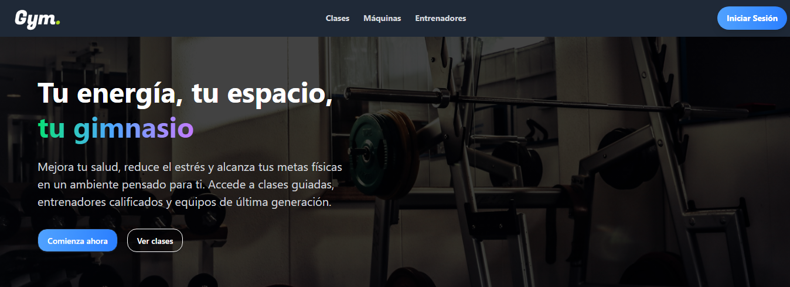

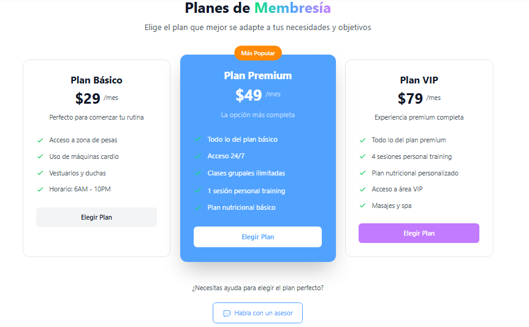
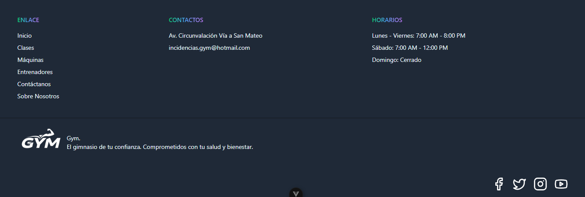

### Clases
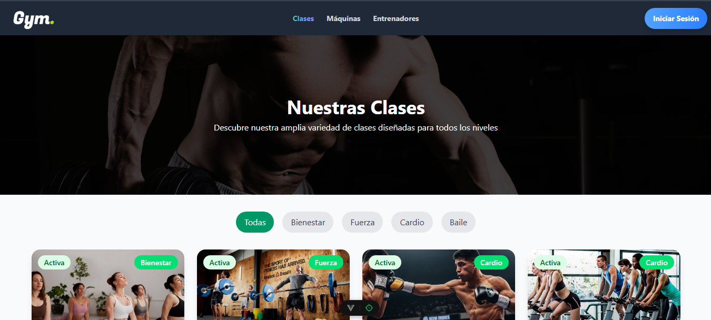
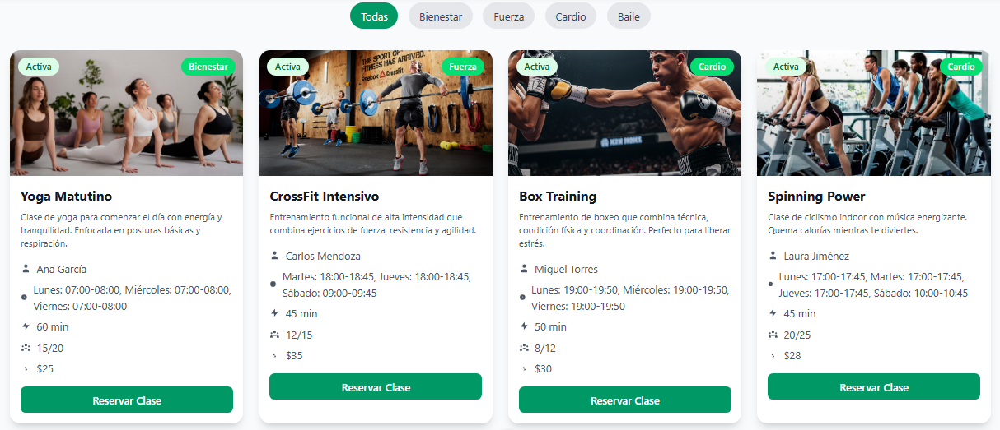

### Máquinas
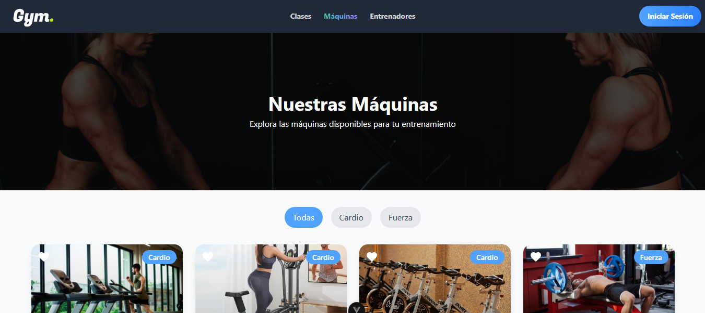
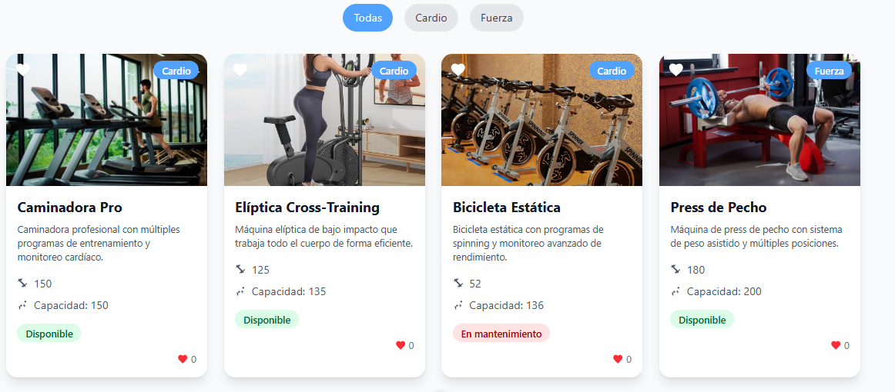

### Entrenadores
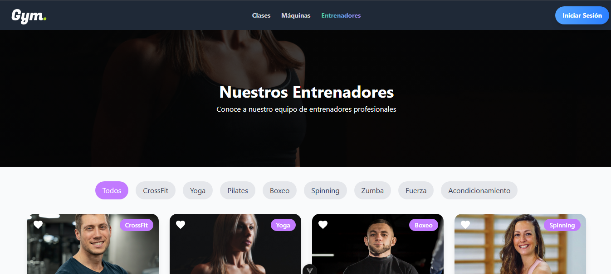
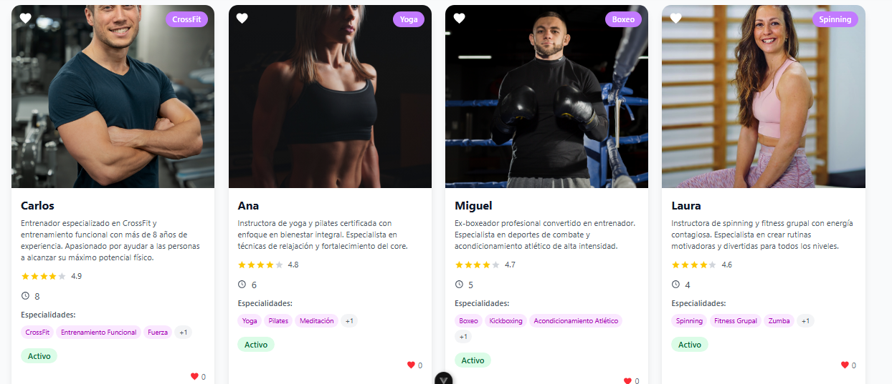

### Contáctanos
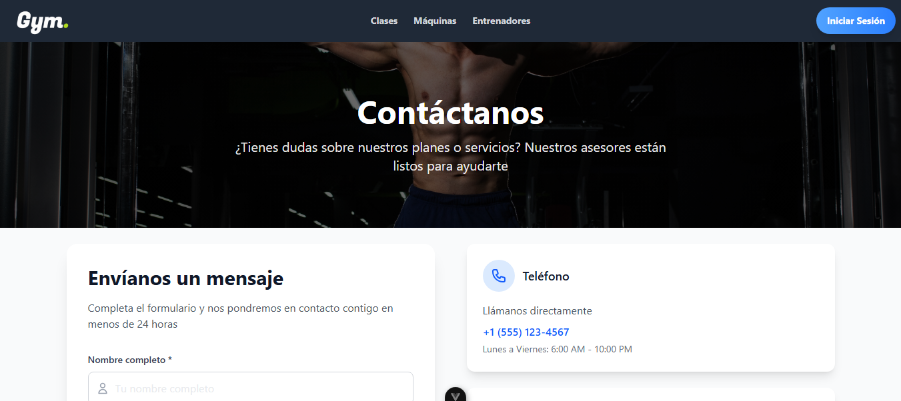
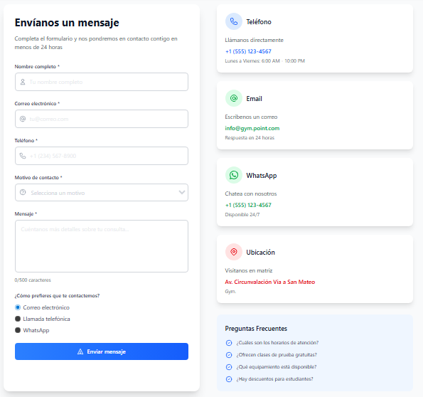

### Sobre Nosotros
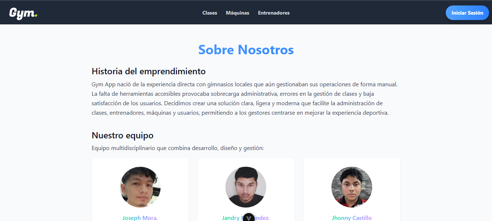
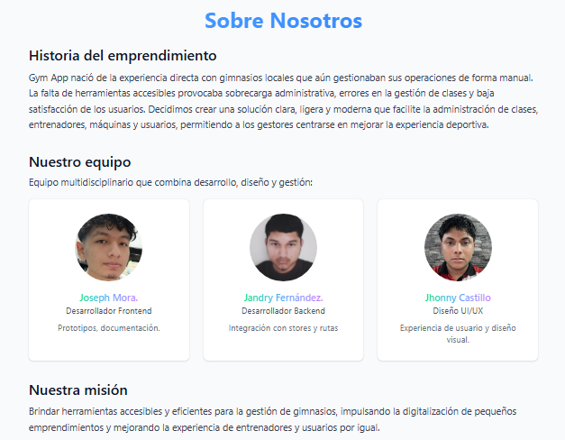

### Inicio de sesión
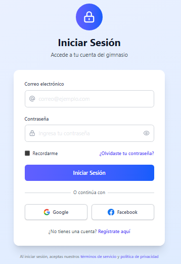

### Registro
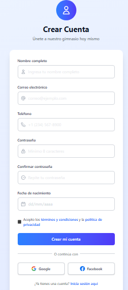

---

## 📝 Conclusiones individuales sobre el aprendizaje

- **Joseph Mora** — ...

- **Jandry Fernández** — Durante el desarrollo del prototipo descubrí nuevas técnicas para documentar el proyecto y vincular capturas en el README. La experiencia fortaleció la colaboración con el equipo y dejó claro que debo repasar conceptos técnicos esenciales y mejorar el criterio para plantear y ejecutar ideas rápidamente.

- **Jhonny Castillo** — El reto principal consistió en convertir los requisitos de administración de un gimnasio en una interfaz clara y atractiva. Adoptar un enfoque de diseño basado en componentes desde el principio fue esencial para mantener la consistencia visual en todas las pantallas. La colaboración directa con el desarrollador frontend facilitó la validación de que los diseños no solo eran estéticos, sino también técnicamente viables para implementar con Tailwind CSS, mejorando así el flujo de trabajo entre diseño y desarrollo.
